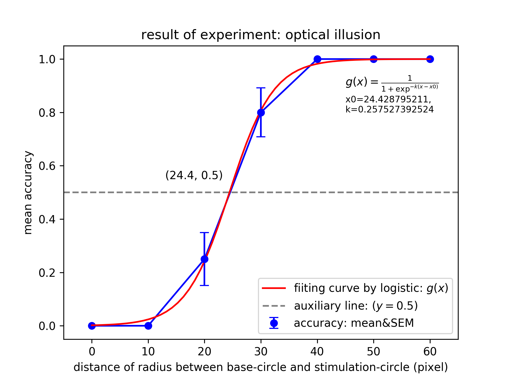

# 錯覚の実験
## 実験手順
0. visual_information_2.pdeを起動してください．
1. 右の円は左の円より大きいでしょうか（中央のクロスマークを見ながら）
2. そう思う場合は，yを押してください．
3. そう思わなければ，nを押してください
4. 全条件が終了するか，'q'，ESCを押すと結果を'rslt.csv'に記録して終了します

## 実験作成手順
1. 7条件の円の半径を用意する（円の半径の初期値は100pixel，拡大幅は10pixel）
2. 乱数を使って，7条件のカウンタバランスをとる
3. 上記，1, 2の手順を20回繰り返して，140試行できるようにする．

## 実験結果

* どちらの円が大きいのか判断が最もつきにくい＝円の大きさが同じに見えるのは，基準円に対して刺激円の半径が約1.244倍となったとき．